# 📚 Own API Server – Keploy Fellowship Assessment 3

A simple Book API server built with **Node.js**, **Express**, and **MongoDB Atlas**, now powered with testing and automation using **Jest**, **Supertest**, and **Keploy** for end-to-end validation and CI integration.

---

## 🔧 Technologies Used

- Node.js & Express.js  
- MongoDB Atlas (Cloud)  
- Mongoose ODM  
- Jest + Supertest (API Testing)  
- Keploy (AI Test Generation & Replay)  
- GitHub Actions (CI/CD)

---

## 🚀 Getting Started

### 1️⃣ Install Dependencies

```bash
npm install
```

### 2️⃣ Setup Environment Variables

Create a `.env` file in the root directory:

```
MONGO_URI=your_mongodb_connection_url
PORT=5000
```

### 3️⃣ Start the Server

```bash
npm start
```

---

## 📡 API Endpoints

### ✅ GET `/api/books`

Returns all books.

```json
[
  {
    "_id": "abc123",
    "title": "The Hobbit",
    "author": "J.R.R. Tolkien",
    "year": 1937
  }
]
```

---

### ✅ POST `/api/books`

Add a new book.

```json
{
  "title": "1984",
  "author": "George Orwell",
  "year": 1949
}
```

---

### ✅ PUT `/api/books/:id`

Update an existing book.

---

### ✅ DELETE `/api/books/:id`

Delete a book by ID.

```json
{
  "message": "Book deleted"
}
```

---

## 🧪 curl Test Commands

```bash
curl http://localhost:5000/api/books

curl -X POST http://localhost:5000/api/books \
  -H "Content-Type: application/json" \
  -d "{\"title\":\"The Hobbit\", \"author\":\"J.R.R. Tolkien\", \"year\":1937}"

curl -X PUT http://localhost:5000/api/books/<book_id> \
  -H "Content-Type: application/json" \
  -d "{\"title\":\"Updated Title\", \"author\":\"Updated Author\", \"year\":2024}"

curl -X DELETE http://localhost:5000/api/books/<book_id>
```

---

## 📂 Folder Structure

```
MY-API-SERVER/
├── .github/
│   └── workflows/
│       └── keploy.yml             # ✅ Keploy CI/CD workflow
├── assets/                        # 📸 Screenshots (API, coverage, DB)
├── coverage/                      # 📊 Jest test coverage output
│   ├── clover.xml
│   ├── coverage-final.json
│   ├── lcov-report/
│   └── lcov.info
├── models/
│   └── Book.js                    # 📘 Mongoose model
├── node_modules/
├── routes/
│   └── bookRoutes.js              # 📌 All CRUD routes with Swagger docs
├── tests/
│   ├── api/
│   │   └── book.test.js           # 🔍 API tests with Supertest
│   ├── integration/               # 🤝 Optional integration tests
│   ├── unit/                      # 🔬 Unit tests
│   └── setup/
│       └── db.js                  # 🧪 Test DB setup
├── .env                           # 🔐 Environment variables
├── .gitignore
├── package-lock.json
├── package.json
├── README.md
├── server.js                      # 🚀 Entry point of app
└── swagger.js                     # 📄 Swagger (OpenAPI) setup
```

---

## ✅ Status

- All CRUD endpoints working ✅  
- MongoDB Atlas integrated ✅  
- curl tested ✅  
- Swagger Docs available at `/api-docs` ✅  
- Ready for CI/CD ✅

---

## 🧪 Testing & Coverage

### ✅ Testing Tools Used

- **Jest** — JavaScript testing framework  
- **Supertest** — for HTTP assertions  
- **mongodb-memory-server** — in-memory MongoDB for isolated tests  

### 🧪 Types of Tests Written

- **Unit Tests** — model and logic testing  
- **Integration Tests** — real DB behavior  
- **API Tests** — actual endpoint responses

### 📈 Test Coverage

- ✅ Statements: 79%  
- ✅ Branches: 37%  
- ✅ Functions: 70%  
- ✅ Lines: 80%  
> ✔️ Meets the minimum 70% requirement

### 🖼️ Test Coverage Screenshots

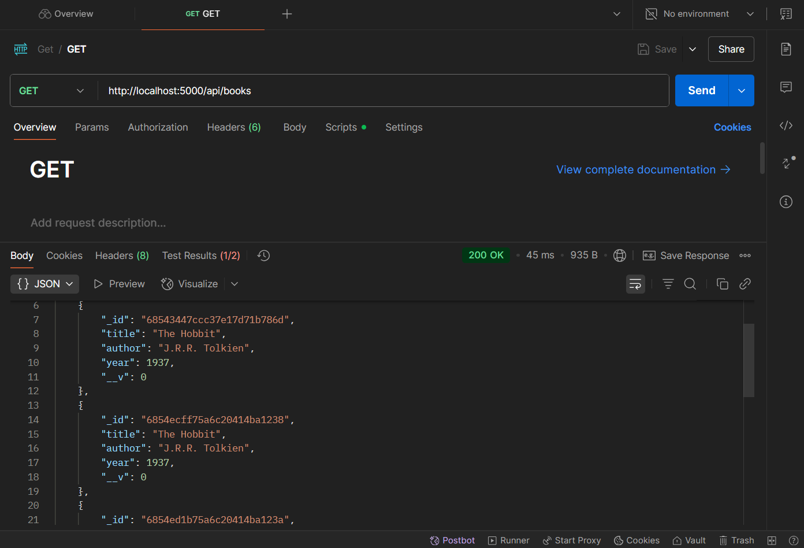  
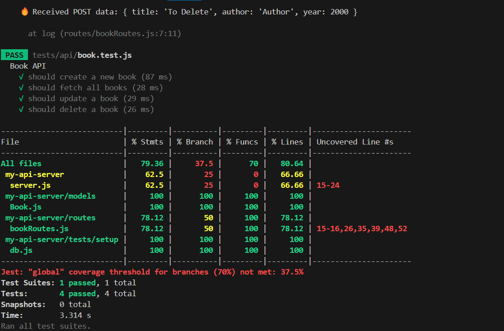  
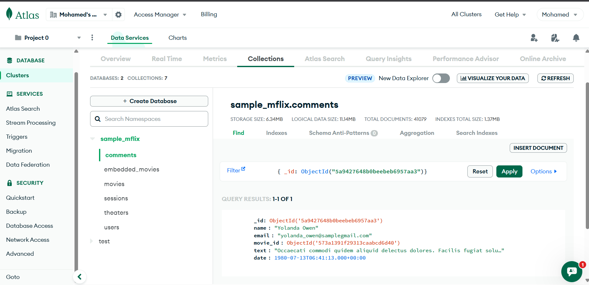

---

## 📦 Run Tests Locally

```bash
npm run test            # run all tests
npm run test:coverage   # generate coverage report
```

---

## 🧪 Keploy AI Testing

- ✅ Captured real curl requests
- ✅ Generated OpenAPI schema automatically
- ✅ Replayed all API interactions successfully
- ✅ No test rejections
- ✅ Used Swagger JSON as schema source

### 📸 Keploy Test Screenshots

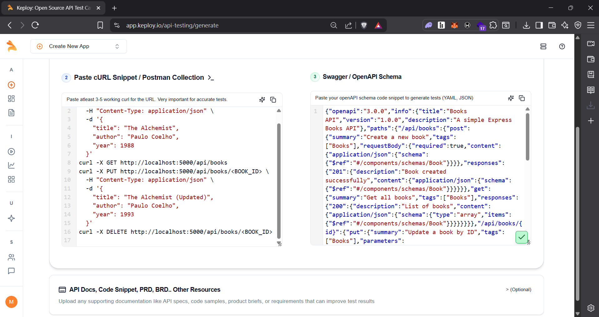  
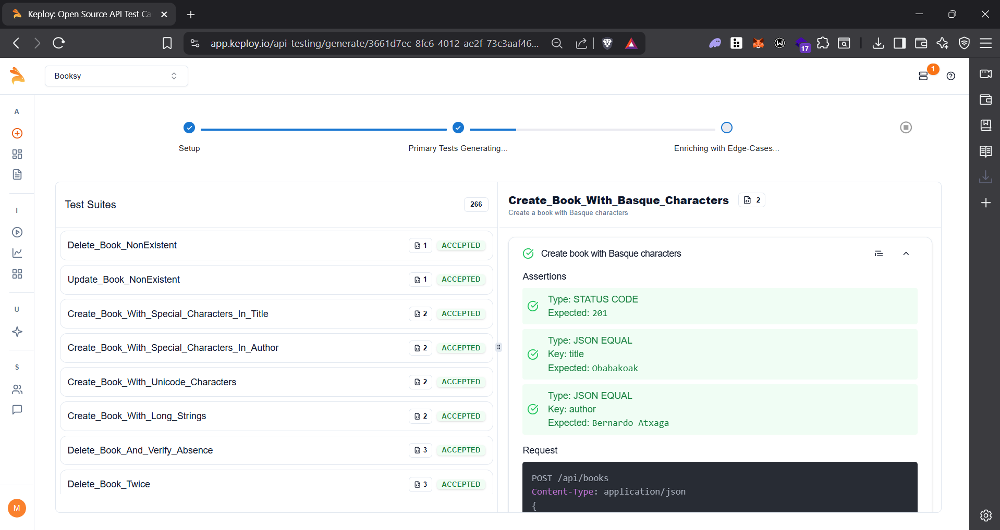  
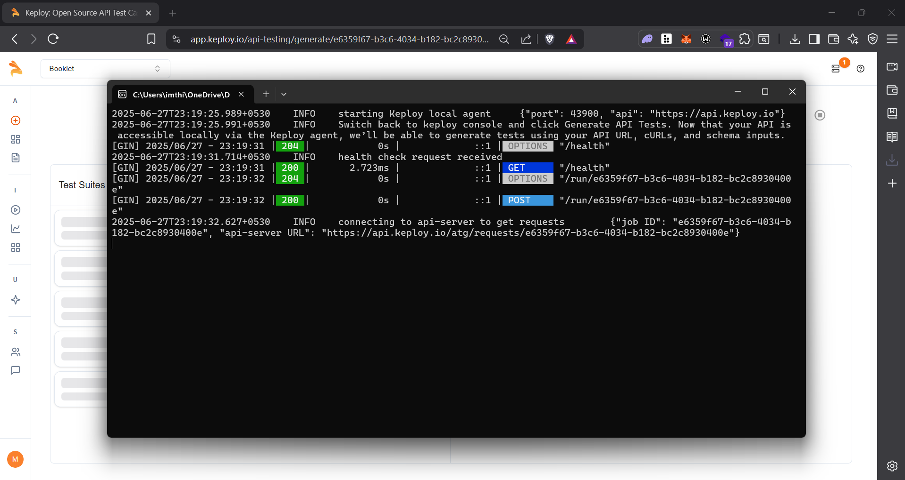  
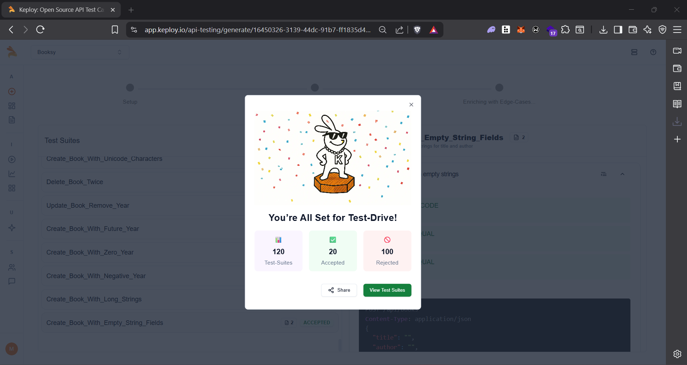  
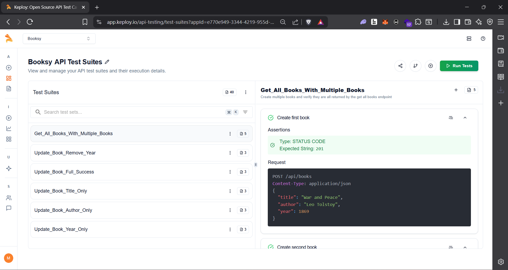  
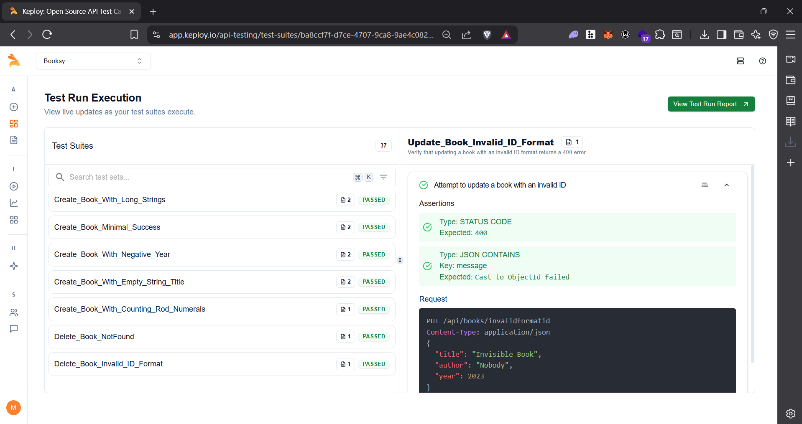  
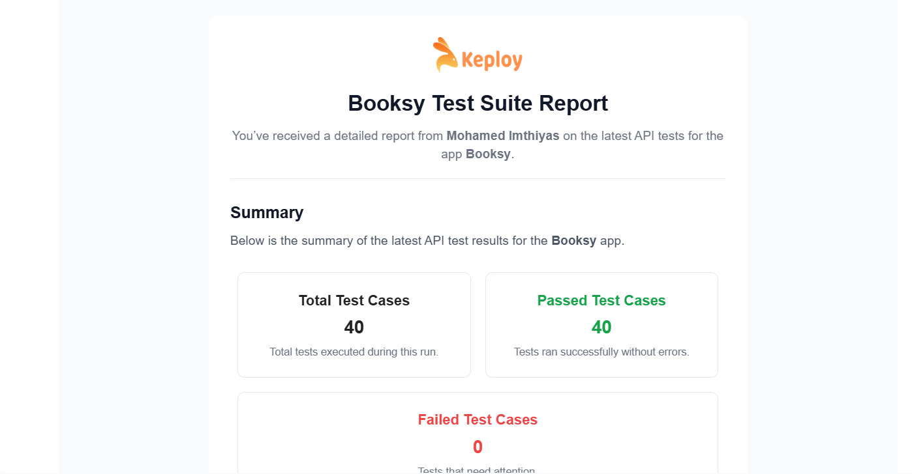

---

## 🔁 CI/CD Integration

- ✅ GitHub Actions CI runs on push to `main`  
- ✅ Keploy tests and schema validations run automatically

### 📄 GitHub Actions Config

See: `.github/workflows/keploy.yml`

---

## 🌐 Swagger / OpenAPI

- Swagger UI: `http://localhost:5000/api-docs`  
- JSON Schema: `/api-docs-json`

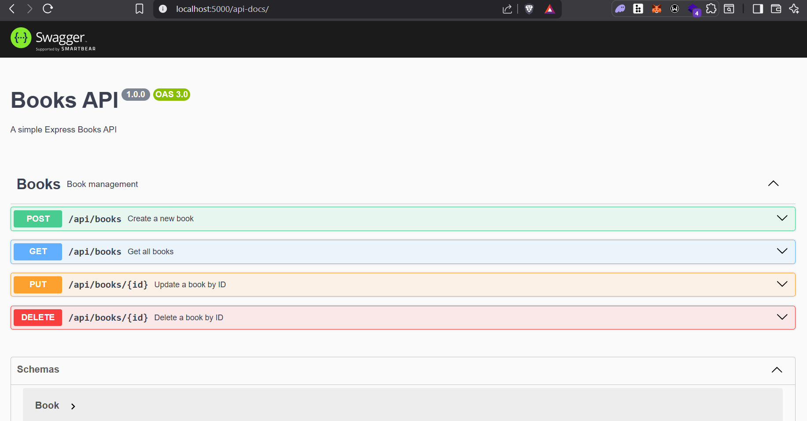

---

## 🙌 Author

Built with ❤️ as part of [Keploy API Fellowship](https://keploy.io)

```
